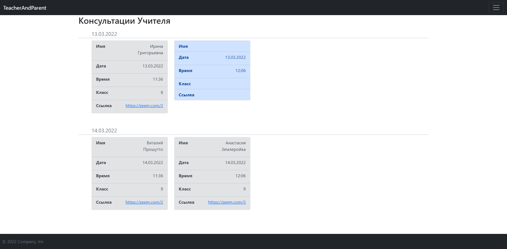
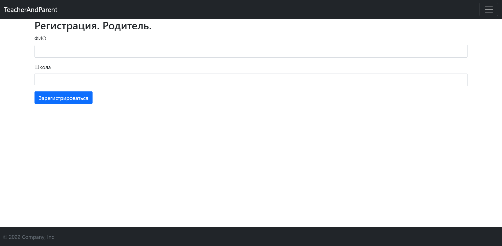

# Техническое задание

### Project name
TeacherAndParent

### Participants 

* Team Lead 
  * Харитонов Максим Дмитриевич

* Project Developers
  * Лесс Михаил Александрович

* Teacher
  * Анатольев Алексей Владимирович

### Description
Программа позволяет создать удобную систему консультаций для учителей и родителей.
Учитель может распределять время для консультаций, а родитель – выбрать нужный сеанс.

### Code Description
Web-приложение создается с помощью микрофреймворка Flask. 
Структура состоит из приложения, модулей отображения консультации и аутентификации соответсвенно, также модели пользователей для базы данных.

### Code Plan
* Переменные, константы
  * Файл конфигурации с константами, для, собственно, конфигурации приложения
  * Переменные в модуле приложения для работы с расширениями flask и им самим.
* Функии
  * Отображения для вывода информации
* Классы
  * Модели БД
* Библиотеки
  * Flask
  * sqlalchemy
  * flask-login
  * flask-wtf

### Graphical interface
* Консультации

* Регистрация

### Deadlines
* Создание команд. Описание проекта – 14.мар
* Задание (ТЗ) – 14.мар
* ТЗ+Часть задания выполнена – 21.мар
* Код+Работающая часть проекта – 28.мар
* Код+Работающая часть+Черновик пояснительной записки и презентации – 04.апр
* Код+Пояснительная записка+Презентация+ПочтиВсе работает – 11.апр
* Все готово – 18.апр